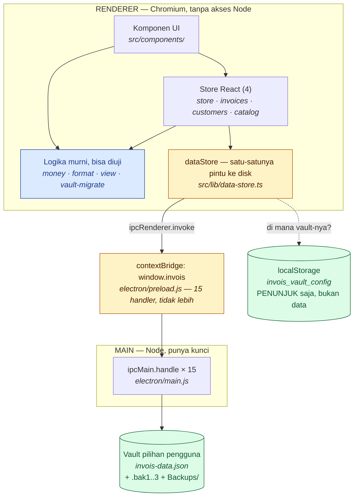
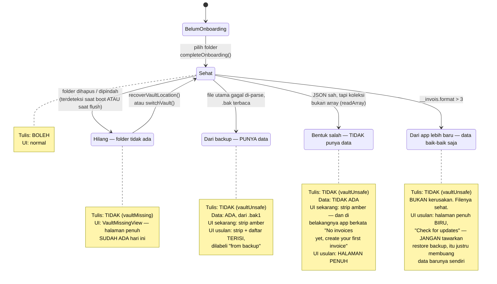
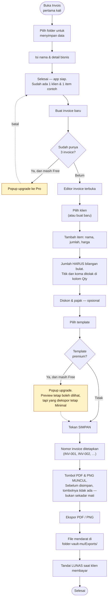
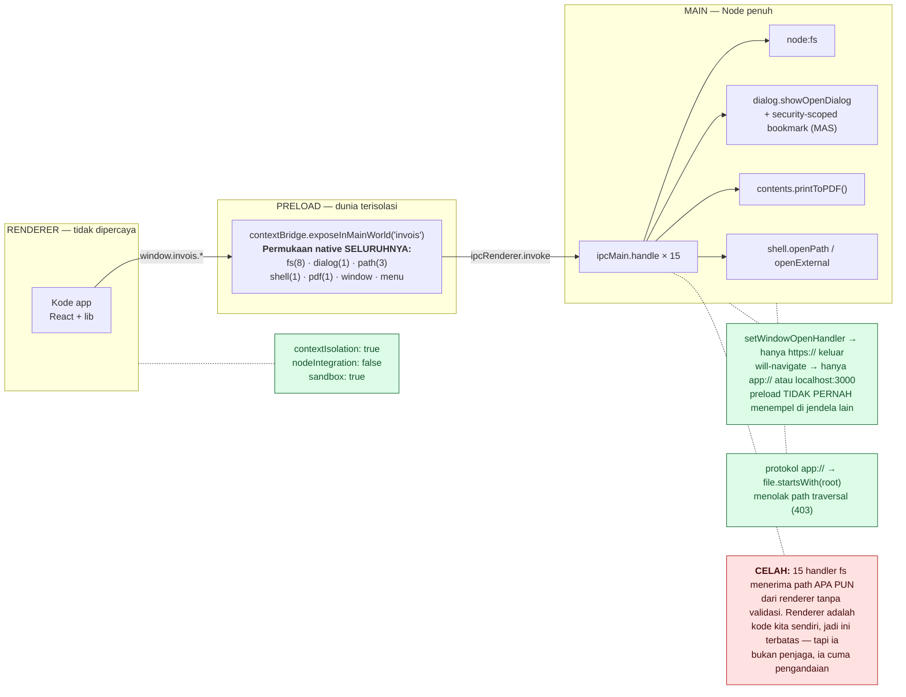

# Invois — alur aplikasi

Enam diagram, berlapis. **Tidak ada satu gambar yang memuat semuanya**, dan itu disengaja: satu
diagram "sedetail-detailnya" tidak bisa dibaca siapa pun, jadi ia berhenti dipakai dan mulai
berbohong. Kedalaman di sini datang dari **jumlah gambar**, bukan dari kepadatan satu gambar.

## Cara membaca

| # | Diagram | Untuk siapa |
|---|---|---|
| 1 | [Peta level-0](#1-peta-level-0) | Semua orang. Mulai dari sini |
| 2 | [Siklus hidup data](#2-siklus-hidup-data) | Developer. **Yang paling berharga** — di sinilah bug bersembunyi |
| 3 | [Mesin keadaan vault](#3-mesin-keadaan-vault) | Developer + desainer |
| 4 | [Perjalanan pengguna](#4-perjalanan-pengguna) | Penguji QA + pengguna awam. Tanpa nama fungsi |
| 5 | [Jalur uang](#5-jalur-uang) | Developer |
| 6 | [Batas kepercayaan](#6-batas-kepercayaan-renderer--main) | Audit keamanan |

## Aturan yang membuat dokumen ini tidak jadi hiasan dinding

**Setiap node menyebut file dan fungsinya.** Bukan gaya — itu supaya kamu bisa mengecek kotaknya
melawan sumbernya dalam sepuluh detik. Diagram yang tidak bisa dijatuhkan adalah kerabat dekat tes
yang tidak bisa gagal: ia hanya membuat orang merasa aman.

**Sumber kebenarannya file ini.** `architecture.html` **diturunkan** dari sini lewat
`node docs/architecture/build.mjs` — jangan mengedit HTML-nya. Satu isi di dua tempat akan menjadi
dua isi yang berbeda; itu cuma soal waktu.

**Kalau kamu mengubah alurnya, ubah gambarnya di commit yang sama.** Diagram yang salah lebih
berbahaya daripada tidak ada diagram, karena orang mempercayainya.

---

## 1. Peta level-0

Satu layar. Apa saja lapisannya, dan siapa boleh bicara dengan siapa.

Dua hal yang perlu diperhatikan, dan keduanya adalah keputusan, bukan kebetulan.

**`data-store.ts` adalah satu-satunya pintu ke disk.** Tidak ada komponen yang menulis file. Kalau
suatu hari ada, aturan "jangan pernah menimpa vault yang gagal dibaca" berhenti bisa ditegakkan dari
satu tempat — dan aturan yang ditegakkan di banyak tempat adalah aturan yang akan dilupakan di salah
satunya.

**Penunjuk vault tinggal di `localStorage`, datanya tidak.** Yang di `localStorage` cuma "vault-mu di
folder mana". Semua isi sesungguhnya ada di file yang pengguna pilih dan bisa ia salin, pindahkan,
dan baca sendiri.

---

## 2. Siklus hidup data

Dari app dibuka sampai byte mendarat di disk. **Kalau kamu cuma sempat membaca satu diagram, baca
yang ini** — sembilan bug nyata yang ditemukan selama QA semuanya hidup di jalur ini.

```mermaid
flowchart TD
    START(["App dibuka"]) --> BOOT["DataBootstrap<br/><i>components/data-bootstrap.tsx</i>"]
    BOOT --> INIT["initDataStore()<br/><i>lib/data-store.ts</i>"]
    INIT --> CFGQ{"invois_vault_config<br/>sudah ada?"}

    CFGQ -->|tidak| ONB["phase: onboarding<br/>pengguna memilih folder"]
    ONB --> COMPLETE["completeOnboarding(dir)<br/>tolak folder yang bersarang<br/>di dalam / memuat vault lain"]
    COMPLETE --> LOAD

    CFGQ -->|ya| GONE{"folder vault<br/>masih ada?"}
    GONE -->|tidak| MISSING["phase: missing<br/><i>VaultMissingView</i>"]
    GONE -->|ya| LOAD["loadVaultFile(dir)"]

    LOAD --> PRIMARY{"invois-data.json<br/>bisa di-parse?"}
    PRIMARY -->|ya| DOC["docToMem(doc)"]
    PRIMARY -->|tidak| BAK{"coba .bak1 → .bak2 → .bak3"}
    BAK -->|ada yang terbaca| BAKOK["source = backup<br/><b>markVaultUnsafe()</b>"]
    BAK -->|tidak ada| EMPTY["source = empty<br/>Map kosong — vault BARU,<br/>bukan vault rusak"]
    BAKOK --> DOC

    DOC --> FMT{"__invois.format ?"}
    FMT -->|"> 3 (dari app lebih baru)"| UNSAFE1["<b>markVaultUnsafe()</b><br/>baca boleh, tulis TIDAK"]
    FMT -->|"< 3 (vault lama)"| MIG["migrateMoneyToMinor()<br/>uang → satuan minor integer<br/><b>TIDAK menandai dirty</b>"]
    FMT -->|"= 3"| MEM
    MIG --> MEM
    UNSAFE1 --> MEM

    MEM[("mem: Map&lt;string,string&gt;<br/>di RAM")] --> HYD["4 store hidrasi<br/>loadVersioned() → readArray()"]
    HYD --> SHAPE{"bentuk tiap koleksi<br/>benar? (array?)"}
    SHAPE -->|tidak| UNSAFE2["<b>markVaultUnsafe()</b><br/><i>lib/vault-read.ts</i><br/>bukan [] palsu"]
    SHAPE -->|ya| READY(["phase: ready — app jalan"])
    UNSAFE2 --> READY

    READY --> EDIT["Pengguna mengetik / menyimpan"]
    EDIT --> SETRAW["setRaw(key, json)<br/>mem.set + <b>dirty = true</b>"]
    SETRAW --> SCHED["scheduleFlush()<br/>debounce 500 ms"]
    SCHED --> FLUSH{"flushNow()"}

    HIDE["Window disembunyikan / ditutup<br/><i>visibilitychange · beforeunload</i>"] --> FLUSH

    FLUSH -->|"vaultUnsafe?"| STOP1["BERHENTI — jangan pernah menimpa<br/>file yang gagal kita baca"]
    FLUSH -->|"!dirty?"| STOP2["BERHENTI — tidak ada yang berubah.<br/>Tanpa cek ini, sekadar me-minimize<br/>jendela merotasi backup"]
    FLUSH -->|"folder hilang?"| STOP3["handleVaultVanished()<br/>→ layar pemulihan.<br/>JANGAN mkdir ulang"]
    FLUSH -->|lolos| WRITE["writeVaultFile()"]

    WRITE --> DAILY["writeDailyBackup()<br/>1× per hari kalender →<br/>Backups/invois-YYYY-MM-DD.json<br/>simpan 14 hari"]
    DAILY --> TMP["tulis invois-data.json.tmp"]
    TMP --> ROT["rotasi dengan SALIN:<br/>bak2→bak3, bak1→bak2, utama→bak1<br/><b>file utama tidak pernah dipindah</b>"]
    ROT --> RENAME["rename(tmp → utama)<br/><b>satu-satunya langkah destruktif,<br/>dan ia atomik</b>"]
    RENAME --> DONE(["dirty = false"])

    classDef bad fill:#fee2e2,stroke:#b91c1c,color:#450a0a
    classDef warn fill:#fef3c7,stroke:#b45309,color:#451a03
    classDef ok fill:#dcfce7,stroke:#166534,color:#14532d
    class UNSAFE1,UNSAFE2,BAKOK warn
    class STOP1,STOP2,STOP3 bad
    class RENAME,DONE ok
```

**Tiga penjaga di `flushNow()` itu bukan hiasan — masing-masing lahir dari kerusakan nyata.**

`!dirty` ada karena dulu tidak ada, dan `flushNow` menyala pada `visibilitychange`. Artinya sekadar
**me-minimize jendela** menulis ulang vault dan merotasi backup. `BACKUP_COUNT = 3` jadi berarti "tiga
kali sembunyi/tampil", bukan "tiga kali simpan" — pengguna bisa kehilangan segalanya tanpa menyentuh
keyboard.

`vaultUnsafe` ada karena menulis vault yang gagal dibaca berarti mengabadikan kekosongan yang tidak
pernah ada.

Dan `rename(tmp → utama)` adalah satu-satunya langkah destruktif karena kode lama merotasi dengan
**memindahkan** file utama (`rename(utama, .bak1)`) lalu baru memindahkan tmp ke tempatnya. Di antara
dua langkah itu **vault tidak ada**. Apa pun yang menyela di sana — quit, crash, reload dev-server —
membawa serta satu-satunya salinan pengguna. Itu bukan teori: itu terjadi pada 13 Juli 2026.

---

## 3. Mesin keadaan vault

Vault punya lima keadaan. Hari ini UI hanya membedakan tiga di antaranya — dan itulah pokok
redesign banner yang sedang menunggu.

Ketiga keadaan bawah dibedakan oleh `getVaultHealth().source` — **kode sudah tahu bedanya, UI-nya yang
belum memakai informasi itu.** Ketiganya digambar sebagai satu strip amber yang sama.

---

## 4. Perjalanan pengguna

Untuk penguji dan pengguna awam. Tidak ada nama fungsi di sini — ini yang **dilihat** orang, bukan
yang dijalankan mesin.

**Kenapa Simpan menggerbangi Ekspor.** Nomor invoice ditetapkan pada saat disimpan. Kalau ekspor
boleh mendahului simpan, PDF yang sudah dikirim ke klien bisa memuat nomor yang kemudian dipakai
invoice lain — dan nomor invoice adalah satu hal yang tidak boleh bertabrakan.

---

## 5. Jalur uang

Uang adalah **bilangan bulat satuan terkecil** dari ujung ke ujung. Diagram ini menunjukkan di mana
— dan **hanya** di mana — ia boleh menjadi desimal.

```mermaid
flowchart LR
    TYPE["Pengguna mengetik<br/>19,99"] --> IN["CurrencyInput<br/>teks → 1999<br/><i>toMinor()</i>"]
    IN --> SAN["sanitizeInvoice()<br/><i>lib/store.tsx</i><br/>apa yang DITAMPILKAN =<br/>apa yang DIJUMLAH"]
    SAN --> STORE[("Vault: 1999<br/>priceMinor")]

    STORE --> CALC["calcTotals()<br/><i>lib/format.ts</i>"]

    subgraph CALC_IN["Di dalam calcTotals — semuanya integer"]
        SUB["subtotal = Σ qty × priceMinor<br/><b>tidak ada pembulatan.</b><br/>Integer × integer = integer"]
        DISC["diskon:<br/>pct → roundHalf() ← pembulatan 1<br/>flat → safeMinor()"]
        TAX["pajak → roundHalf() ← pembulatan 2"]
        TOT["total = subtotal − diskon + pajak"]
        SUB --> DISC --> TAX --> TOT
    end

    CALC --> CALC_IN
    TOT --> FMT["formatMoney(1999, USD)<br/>→ '$19.99'<br/><i>Intl.NumberFormat di-cache<br/>per mata uang — 68× lebih cepat</i>"]
    FMT --> SCREEN["Layar"]
    FMT --> PDF["PDF (printToPDF — vektor)<br/>PNG (html2canvas — raster)"]

    classDef round fill:#fef3c7,stroke:#b45309,color:#451a03
    classDef edge fill:#dbeafe,stroke:#1e40af,color:#1e3a8a
    class DISC,TAX round
    class IN,FMT edge
```

**Hanya ada dua titik pembulatan di seluruh aplikasi**, dan keduanya dipaksa oleh persentase: 10% dari
5.999 adalah 599,9, dan koin itu tidak ada. Subtotal tidak butuh pembulatan sama sekali — itulah
imbalan dari memaksa qty jadi bilangan bulat.

**Desimal hanya hidup di dua tepi:** kolom input, dan formatter. Kalau kamu menemukan `price / 100` di
tempat lain mana pun, ada yang salah.

---

## 6. Batas kepercayaan (renderer → main)

Untuk audit. Yang berjalan di sebelah kiri **tidak punya akses Node**; yang di kanan punya kunci
rumah.

Yang sudah benar: `contextIsolation`, `nodeIntegration: false`, `sandbox: true`, penjaga navigasi, dan
protokol `app://` yang menolak path traversal.

Yang belum: **handler `fs:*` menerima path apa pun.** Renderer memang kode kita sendiri, jadi risikonya
terbatas hari ini — tapi "renderer tidak akan mengirim path jahat" adalah **pengandaian**, bukan
penjaga. Satu XSS lewat konten invoice atau logo yang di-import, dan pengandaian itu runtuh. Perbaikan
yang murah: batasi `fs:*` ke direktori vault dan folder ekspor.

---

*Digambar 14 Juli 2026 dengan membaca kode, bukan dari ingatan. Setiap nama file dan fungsi di atas
diverifikasi ada — lihat `build.mjs` untuk memperbarui `architecture.html`.*
